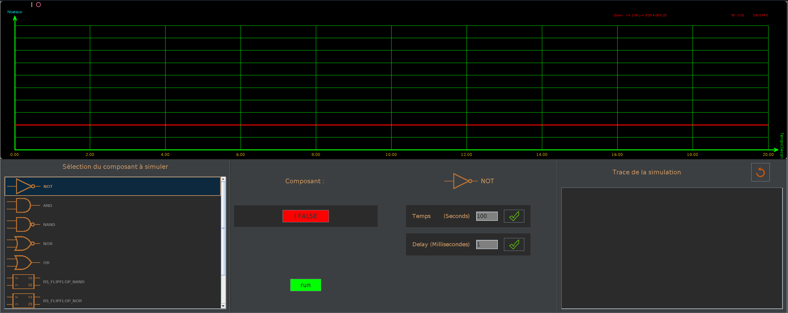
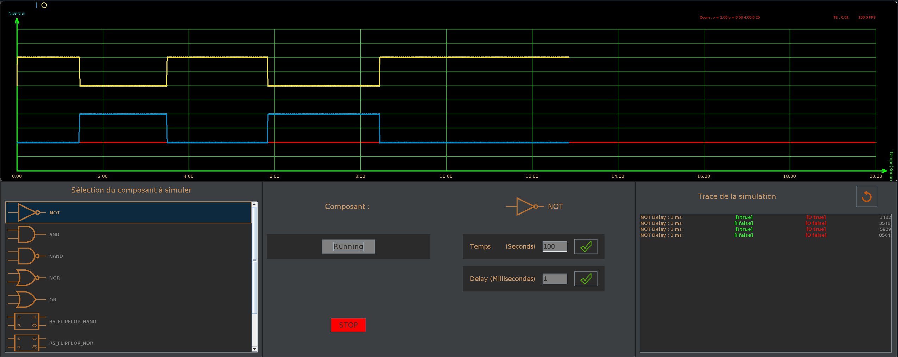
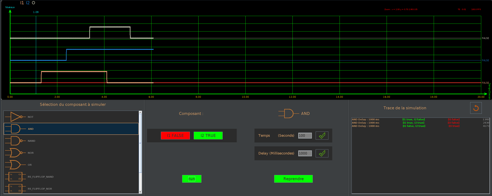
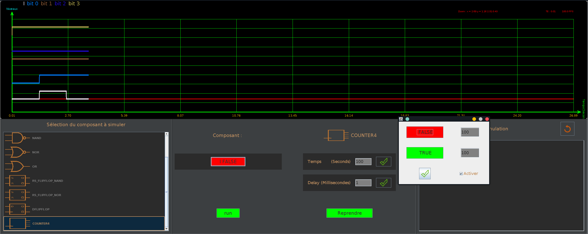
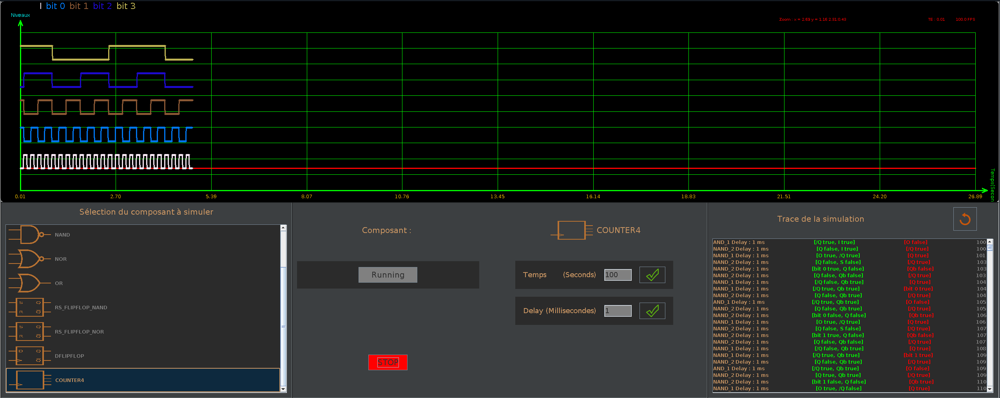
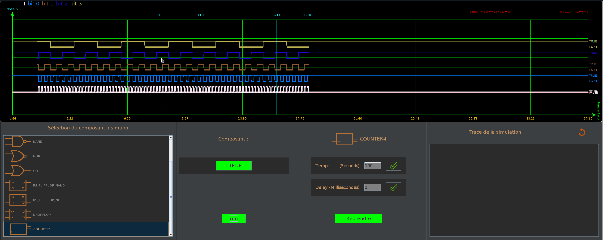

# LogicSimulator
Développement d'une interface graphique, pour la simulation de portes logiques de base.  
La propagation des signaux sont parallélisé.
## Overview
Features :
1. Évolution des signaux d'entrée et sortie de la porte logique en temps réel.
2. Choix de la porte logique à simuler.
3. Modification des signaux d'entrer. Initialisation/modification temps réel (Manuel, Signal d'horloge).
4. Paramétrage du temps de la simulation et délai de propagation des signaux entre portes logiques.
5. Détail de la propagation du signal entre portes logiques. 
### Interface graphique générale

### Simulation d'une porte __NOT__ en temps réel
La propagation en temps réel du signal est paramétrée à 1 ms, le temps de stimulation est fixé à 100 secondes.  

### Simulation d'une porte __AND__ en temps réel
La propagation en temps réel des signaux est paramétrée à 1000 ms, le temps de stimulation est fixé à 100 secondes.  

### Simulation d'un compteur 4 bits

Le signal d'entrée est paramétré pour générer un front montant toute les 200 ms.  

### Feature du graphique
1. Zoom verticale /horizontale
2. Ajout de curseurs verticaux/Horizontaux 

